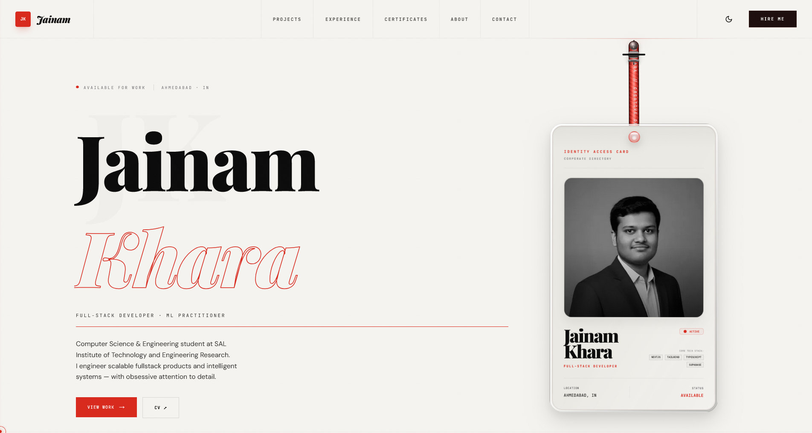

# 📐 Jainam Khara Portfolio

A high-performance personal portfolio built with **Next.js 15**, **React 19**, **Tailwind CSS 4**, and **Three.js** featuring a premium Editorial Brutalist design system with interactive animations, physics-based interactions, and seamless user experience.

[](https://nextjs.org/)
[](https://react.dev/)
[](https://tailwindcss.com/)
[](https://threejs.org/)
[](https://gsap.com/)
[](https://www.framer.com/motion/)

🌐 **Live Website**: [jainamkhara.app](https://jainamkhara.app)

---

## 🎨 Hero Section



The landing page features an asymmetric layout with interactive physics-based elements, staggered animations, and a cinematic boot sequence that greets visitors.

---

## ✨ Key Features

- **🪪 Interactive Physics ID Badge** - Draggable lanyard with realistic gravity, momentum, and spring-based animations
- **🎬 Mechanical Letterpress Loading Screen** - Typographic boot sequence with sequential letter stamping, baseline rules, and vertical shutter reveal
- **⚡ Technical SEO & Structured Data** - Schema.org JSON-LD `Person` entity markup, dynamic XML sitemaps, OpenGraph/Twitter cards, and Google Search Console verification
- **📜 Staggered Scroll Reveals** - Content cascades onto screen with smooth spring physics and calculated delays
- **🎛️ Tech Grid with Adaptive Contrast** - Intelligent styling with grayscale-to-color hover transitions
- **🌓 Dark/Light Theme System** - Blueprint aesthetic with seamless theme switching maintaining perfect contrast
- **💬 Smooth Momentum Scrolling** - Lenis scroll engine for premium, responsive scrolling experience
- **📱 Fully Responsive** - Mobile-first design working perfectly on all devices
- **⚡ Performance Optimized** - GPU-accelerated animations, lazy loading, and optimized bundle size

---

## 🎨 Design Philosophy

**Editorial Brutalism** - A design approach that rejects glossy trends in favor of intentional, minimalist design:

- **Sharp, Structural Design** - 1-2px borders, precise alignment, no rounded corners or excessive smoothing
- **Strategic Color Palette** - Black (#09090C dark / #F4F4F3 light) with teal accents (#0d9488 / #14b8a6)
- **Premium Typography** - Serif display headers for editorial feel, sans-serif body for readability
- **Asymmetric Layouts** - Breaks traditional hero split designs with unconventional positioning
- **GPU-Accelerated Animations** - Transform/opacity only for consistent 60fps performance
- **No Anti-Patterns** - Explicitly rejects glassmorphism, mesh gradients, and generic layouts

---

## 🛠️ Technology Stack

### Core Framework

- **Next.js 15** - App Router, server components, optimized builds
- **React 19** - Latest features, concurrent rendering
- **TypeScript** - Type safety throughout the codebase

### Styling & Design

- **Tailwind CSS 4** - Utility-first CSS framework
- **shadcn/ui** - High-quality, accessible component primitives
- **Lucide React** - Beautiful, consistent icon library

### Animation & Motion

- **GSAP 3.15** - Advanced animation sequencing, spring dynamics, scroll triggers
- **Framer Motion 12.9** - React component animations with variants and gestures
- **React** - Built-in animation hooks and transitions

### 3D & Graphics

- **Three.js** - WebGL 3D graphics and particle systems
- **React Three Fiber (R3F)** - Three.js components in React
- **Drei** - Useful React Three Fiber abstractions

### Forms & Validation

- **React Hook Form 7.56** - Performant form state management
- **Zod 3.24** - TypeScript-first schema validation
- **Resend SDK 6.10** - Email delivery service

### Interaction & Performance

- **Lenis 1.3** - Smooth, momentum-based scrolling
- **Intersection Observer API** - Scroll-triggered animations
- **Next Themes** - Dark mode/light mode management
- **Tailwind Merge** - Smart class merging

---

## 📂 Project Structure

```
├── app/
│   ├── (routes)/
│   │   ├── about/              # Profile and biography page
│   │   ├── certificates/       # Credentials showcase
│   │   │   └── [slug]/         # Dynamic certificate detail page
│   │   ├── contact/            # Contact form page
│   │   ├── experience/         # Career timeline page
│   │   ├── projects/           # Project catalog
│   │   │   └── [slug]/         # Dynamic project detail page
│   │   ├── layout.tsx
│   │   └── page.tsx
│   ├── api/
│   │   └── contact/            # Email API endpoint (Resend)
│   ├── client-layout.tsx       # Theme provider, Lenis scroll loop
│   ├── globals.css             # Global styles and custom fonts
│   ├── layout.tsx              # Root HTML layout, SEO metadata, JSON-LD Schema
│   ├── page.tsx                # Home landing page
│   ├── robots.ts               # Dynamic robots.txt crawler directives
│   └── sitemap.ts              # Dynamic XML sitemap generator
│
├── components/
│   ├── home/
│   │   ├── hero.tsx            # Hero section with asymmetric layout
│   │   ├── id-card.tsx         # Physics-based lanyard interaction
│   │   ├── id-card-ui.tsx      # ID badge visual design
│   │   ├── achievements.tsx    # Stats and metrics block
│   │   ├── featured-projects.tsx # Project carousel
│   │   ├── skills-showcase.tsx # Tech grid with adaptive contrast
│   │   └── testimonials.tsx    # Recommendations slider
│   ├── certificates/           # Certificate display components
│   ├── experience/             # Timeline visualization
│   ├── contact/                # Contact form with validation
│   ├── projects/               # Project cards and details
│   ├── layout/
│   │   ├── navbar.tsx          # Top navigation bar
│   │   ├── footer.tsx          # Footer with links
│   │   └── theme-switch.tsx    # Dark/light theme toggle
│   ├── shared/
│   │   ├── animated-icon.tsx   # SVG animated icon
│   │   ├── custom-cursor.tsx   # Custom desktop cursor
│   │   ├── decoder-text.tsx    # Text scramble reveal effect
│   │   ├── interactive-background.tsx # Canvas background grid
│   │   ├── loading-screen.tsx  # Mechanical letterpress animation
│   │   ├── reveal-line.tsx     # Sweep line primitive
│   │   ├── scroll-progress.tsx # Top scroll progress indicator
│   │   ├── scroll-to-top.tsx   # Scroll to top float button
│   │   ├── section-divider.tsx # Section separator line
│   │   ├── smooth-scroll-provider.tsx # Lenis + GSAP scroll sync
│   │   └── tech-icon.tsx       # SVG technology logo renderer
│   └── ui/                     # shadcn UI components
│
├── data/
│   ├── projects.ts            # Project catalog data
│   ├── experience.ts          # Career timeline data
│   ├── certificates.ts        # Professional credentials
│   ├── skills.ts              # Technology stack
│   ├── education.ts           # Educational background
│   └── social.ts              # Social media links
│
├── lib/
│   ├── animations.ts          # GSAP configurations
│   ├── constants.ts           # Global constants
│   └── utils.ts               # Utility functions
│
├── public/
│   ├── assets/                # Logos and images
│   ├── cv.pdf                 # Resume/CV
│   └── videos/                # Project previews
│
├── screenshots/               # Portfolio screenshots (7 pages)
├── .env.local                 # Environment variables (not versioned)
├── package.json
├── tailwind.config.ts
├── tsconfig.json
└── next.config.ts
```

---

## 🚀 Getting Started

### Prerequisites

- **Node.js** v18.18+ or v20+
- **npm**, **pnpm**, or **yarn**

### Installation Steps

1. **Clone the repository**

```bash
git clone https://github.com/JainamKhara/portfolio.git
cd portfolio
```

2. **Install dependencies**

```bash
npm install
```

3. **Set up environment variables**

Create a `.env.local` file in the project root:

```env
RESEND_API_KEY=your_resend_api_key_here
```

Get your Resend API key at [resend.com](https://resend.com)

4. **Run the development server**

```bash
npm run dev
```

Open [http://localhost:3000](http://localhost:3000) in your browser. The page will auto-refresh as you make changes.

5. **Build for production**

```bash
npm run build
npm start
```

---

## 💡 Animation & Interaction Details

### GSAP Implementation

- Timeline-based animation sequences with mechanical spring recoil
- **Letterpress Loading Animation**: Sequential letter stamping (Boot → Coalesce → Identity → Reveal stages) with:
  - Individual letter elastic animations with custom spring tension
  - Animated baseline rule accents sliding out after each stamp
  - Ink pressure grain texture that spikes on impact and decays naturally
  - 6-column vertical shutter reveal with alternating up/down slide
  - Canvas-based rendering for high-performance typography
- Spring dynamics for physics-based interactions
- Scroll triggers for staggered content reveals
- Elastic animations with customizable tension and friction

### Framer Motion

- Component enter/exit animations
- Gesture-based interactions and drag handlers
- Layout animations for smooth DOM updates
- Coordinated parent-child animations

### Canvas & Graphics

- High-performance 2D canvas rendering for loading screen typography
- Debossed drop shadows with alphabetic baseline alignment
- Ink texture simulation with seeded pseudo-random grain patterns
- Corner drafting compass circles and layout guides
- Dynamic color parsing from CSS theme tokens

### Performance Optimizations

- GPU-accelerated animations (transform/opacity only)
- Intersection Observer for scroll-triggered animations
- Lazy loading of components and images
- Optimized bundle size with tree-shaking

---

## 📬 Connect & Support

**Questions or Collaboration?** Reach out:

- **Email**: [kharajaynam@gmail.com](mailto:kharajaynam@gmail.com)
- **LinkedIn**: [Jainam Khara](https://www.linkedin.com/in/jainamkhara/)
- **GitHub**: [@JainamKhara](https://github.com/JainamKhara)
- **Portfolio**: [jainamkhara.app](https://jainamkhara.app)

---

## 🌟 Show Your Support

If you find this project useful or technically impressive, please give it a ⭐️ on [GitHub](https://github.com/JainamKhara/portfolio). It helps others discover quality portfolio implementations!

---

## 📚 Learning Resources

Interested in learning the techniques used?

- **GSAP Documentation**: https://gsap.com/docs/
- **Three.js Guide**: https://threejs.org/docs/
- **React Three Fiber**: https://docs.pmnd.rs/react-three-fiber/
- **Framer Motion**: https://www.framer.com/motion/
- **Tailwind CSS**: https://tailwindcss.com/docs
- **Next.js App Router**: https://nextjs.org/docs/app
- **React Hook Form**: https://react-hook-form.com/
- **Zod Validation**: https://zod.dev/

---

## 📄 License

This project is distributed under the **MIT License**. See [LICENSE](LICENSE) for more information.

You are free to use, modify, and distribute this code for personal or commercial projects.
